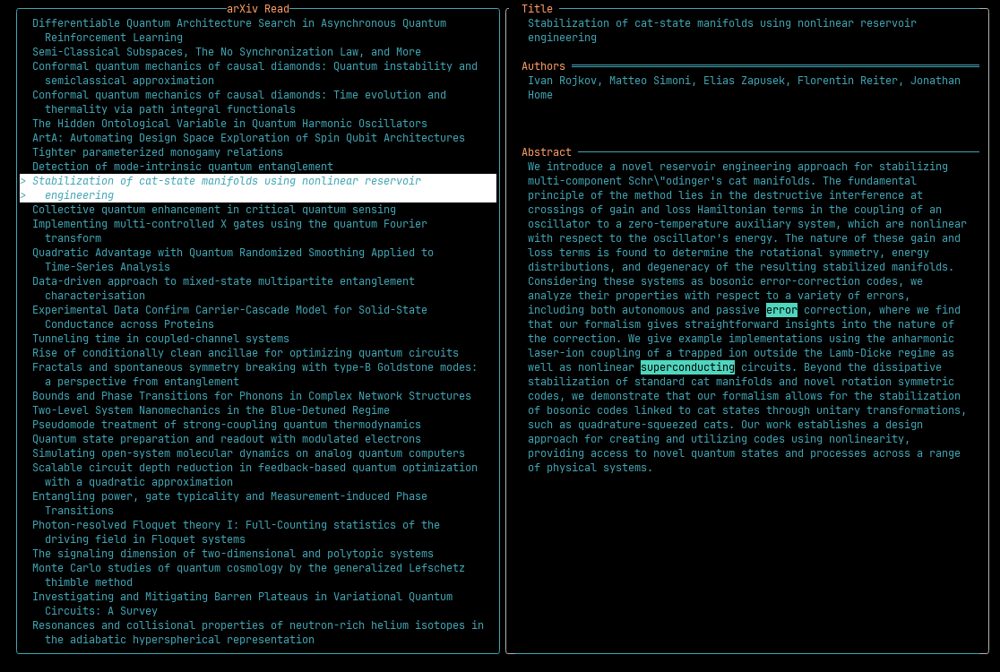

# arXivLens: A Terminal User Interface arXiv Explorer
ArxivLens is a Rust-based terminal user interface (TUI) application that helps you browse and explore new abstracts on the arXiv repository. The name was suggested by the AI assistant, Gemini!

## Motivation
This project arose from a desire to create a convenient way to explore the latest arXiv entries in specific categories (like "quant-ph"). The goal was to replicate the experience of browsing submitted manuscripts on the arXiv website, allowing you to scan through abstracts and search for keywords or familiar authors. Additionally, it served as a platform for myself to experiment and learn with the Rust programming language.

## Features



- Browse new abstracts in your chosen category (default: "quant-ph")
- Search for specific authors in the arXiv database
- Highlight keywords and authors in abstracts and titles
- View detailed article information including authors, summary, and publication dates
- Customizable configuration for default category and highlighting preferences
- Fast and efficient terminal-based interface
- Support for all arXiv categories (e.g., quant-ph, cs.AI, math.AG)

## Installation

### From crates.io (Stable Release)
```bash
cargo install arxivlens
```

### From GitHub (Development Version)
```bash
# Clone the repository
git clone https://github.com/yourusername/arxivlens.git
cd arxivlens

# Install the development version
cargo install --path .
```

You will then be able to use the command `arxivlens` from any place in your system.

## Usage

### Command Line Options
```bash
arxivlens [OPTIONS]

Options:
  -a, --author <AUTHOR>      Name of the author to search for in arXiv entries
  -c, --category <CATEGORY>  ArXiv category to search (e.g., "quant-ph", "cs.AI")
  -h, --help                 Print help
  -V, --version              Print version
```

### Keyboard Shortcuts
- `↑` / `↓`: Navigate through article list
- `Enter`: View detailed article information
- `q`: Quit the application
- `Esc`: Return to article list from detail view

### Configuration
If `$XDG_CONFIG_HOME/arxivlens/config.toml` exists, it will be read and used. If `$XDG_CONFIG_HOME` is not set, `~/.cache/` will be used instead.

Example config file:
```toml
[query]
category = "quant-ph"

[highlight]
authors = ["Schrodinger", "Becquerel"]
keywords = ["quantum", "Error Correction"]
```

The configuration supports:
- Default category for arXiv queries
- List of authors to highlight in the article list
- List of keywords to highlight in abstracts and titles

## Examples

1. Browse quantum physics papers:
```bash
arxivlens
```

2. Search for a specific author in CS.AI category:
```bash
arxivlens -c "cs.AI" -a "Hinton"
```

3. Explore mathematics papers:
```bash
arxivlens -c "math.AG"
```

## Project Structure
The project is organized as follows:

```text
src/
├── main.rs           # Application entry point and CLI argument handling
├── lib.rs            # Library exports and module declarations
├── app.rs            # Main application state and logic
├── config.rs         # Configuration management and validation
├── event.rs          # Event handling system
├── handler.rs        # Event handlers for user interactions
├── tui.rs            # Terminal UI setup and rendering
├── ui.rs             # UI module declarations
├── search_highlight.rs # Search result highlighting
├── arxiv.rs          # Arxiv module declarations
├── ui/               # UI components
│   ├── list.rs       # Paper list view
│   ├── detail.rs     # Paper detail view
│   └── style.rs      # UI styling and themes
└── arxiv/            # Arxiv API integration
    ├── query.rs      # Arxiv API query handling
    └── parsing.rs    # XML response parsing
```

### Key Components

- **main.rs**: Handles CLI arguments and initializes the application
- **app.rs**: Manages application state and coordinates between components
- **config.rs**: Handles configuration loading, validation, and defaults
- **event.rs**: Defines the event system for handling user input
- **handler.rs**: Implements event handlers for user interactions
- **tui.rs**: Sets up the terminal UI and handles rendering
- **ui/**: Contains UI components for different views
  - **list.rs**: Displays the list of papers
  - **detail.rs**: Shows detailed paper information
  - **style.rs**: Defines UI styling and themes
- **arxiv/**: Manages Arxiv API integration
  - **query.rs**: Handles API queries and responses
  - **parsing.rs**: Parses XML responses into Rust structs

## Contributing
Contributions are welcome! Please feel free to submit a Pull Request.

## Development Setup
To ensure code quality and architectural boundaries, please run:
`git config core.hooksPath .githooks`

## License
This project is licensed under the MIT license.
